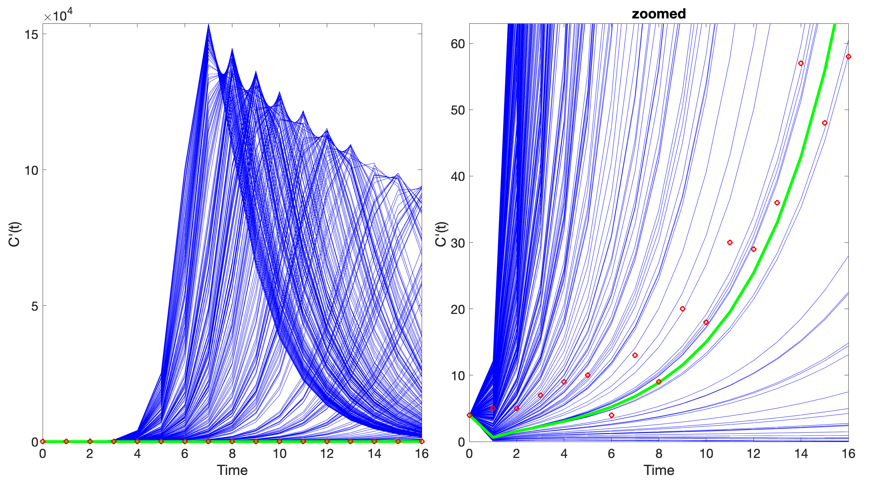
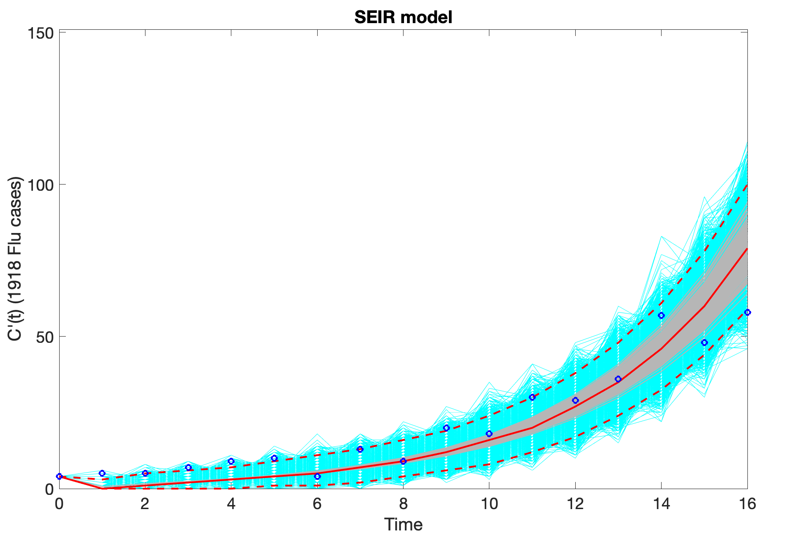
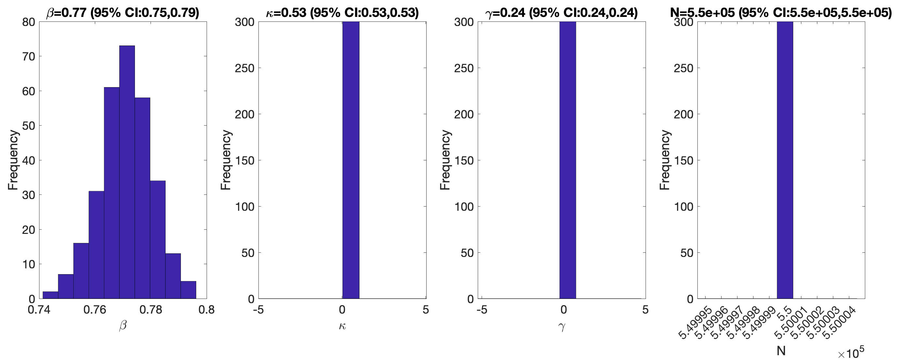
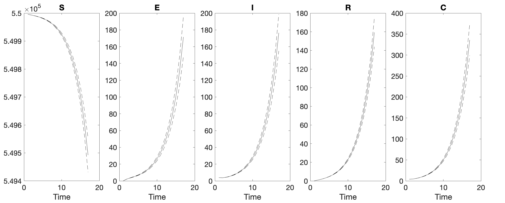
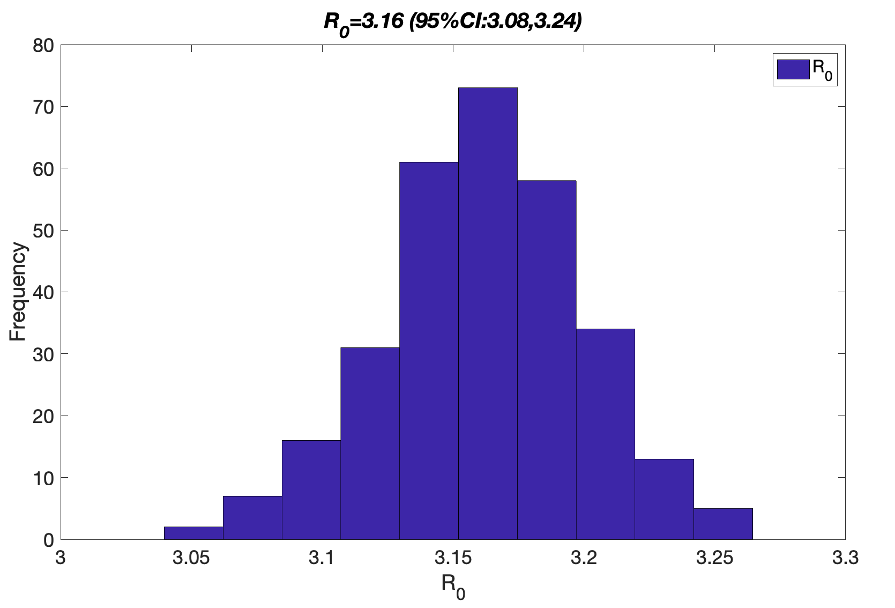
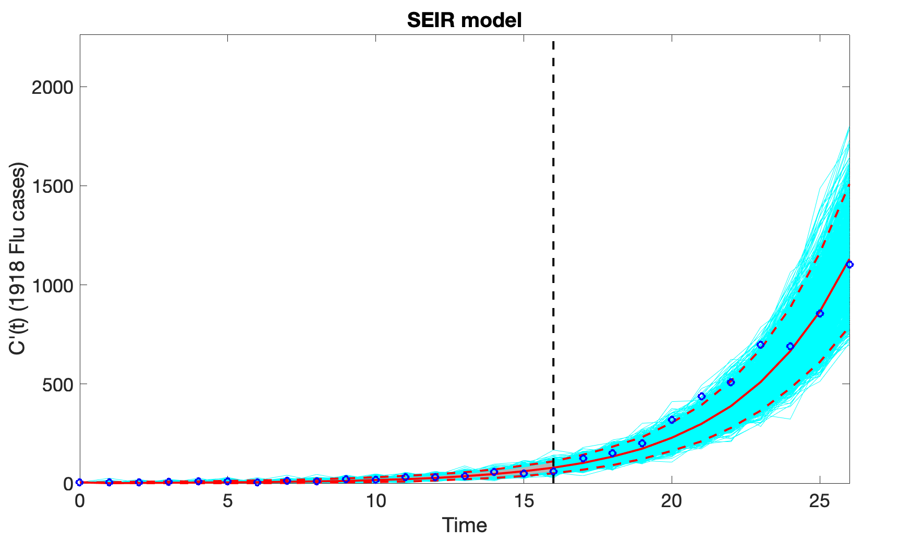
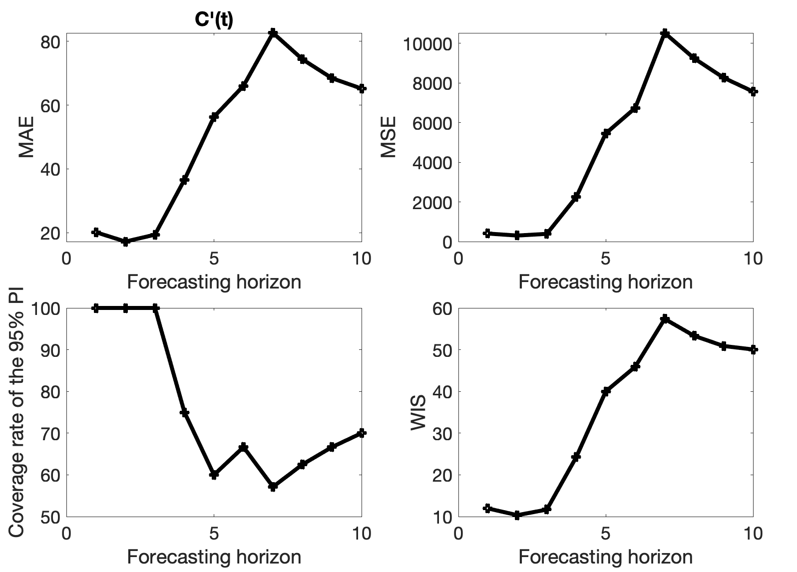

# QuantDiffForecast: A MATLAB Toolbox for Parameter Estimation and Forecasting with ODE Models

QuantDiffForecast is a MATLAB toolbox for parameter estimation and short-term forecasting with quantified uncertainty for ODE models, featuring rolling-window calibration, bootstrap CIs/PIs, and multiple error models (Normal/Poisson/NegBin).

📄 **QuantDiffForecast Tutorial**: [https://onlinelibrary.wiley.com/doi/full/10.1002/sim.10036](https://onlinelibrary.wiley.com/doi/full/10.1002/sim.10036)

🎥 **Video Tutorial**: [https://www.youtube.com/watch?v=eyyX63H12sY&t=41s](https://www.youtube.com/watch?v=eyyX63H12sY&t=41s)

---

## Features

- **Parameter estimation**: Provides methods for parameter estimation using nonlinear least squares (NLS) and maximum likelihood estimation (MLE), with support for Poisson, negative binomial, and normal error structures. The modeler can fit a model to one or multiple time series.
- **Forecasting with quantified uncertainty**: Generates forecasts using parametric bootstrapping to provide uncertainty quantification and prediction intervals.
- **Flexible model input**: Users can define their own ODE models and parameter ranges, supported by customizable input files.
- **Rolling window analysis**: Evaluate parameter stability and forecast performance over time.
- **Illustrative examples**: Includes built-in examples such as epidemic models applied to the 1918 influenza pandemic.

## Getting Started

To get started, you'll need to create a `.txt` file containing your time-series data. Place this file in the `input` folder, and then specify the ODE model and related parameters in the MATLAB `.m` files. 

### Example: SEIR Model for Epidemics

The simplest example provided in this repository is an SEIR (Susceptible-Exposed-Infectious-Removed) model, applied to data from the 1918 influenza pandemic in San Francisco.

Specify the SEIR model parameters in `options_fit_*.m` and `options_forecast_*.m`.

for a new problem, copy an example options_fit_*.m file, change the data file and parameter settings.

## Configure once: the options files

- **[options_fit_*.m](./forecasting_odemodels%20code/options_fit.m)** — estimation settings for fitting (used by `Run_Fit_ODEModel`).
- **[options_forecast_*.m](./forecasting_odemodels%20code/options_forecast.m)** — forecast horizon + performance settings (used by `Run_Forecasting_ODEModel`).

> Tip: run `help options_fit_*` / `help options_forecast_*` in MATLAB to see the in-file headers.


## Options files configurations

| Setting                                      | Where                                 | What it controls                                                                                           | Typical values                                                                                                                                                            |
| -------------------------------------------- | ------------------------------------- | ---------------------------------------------------------------------------------------------------------- | ------------------------------------------------------------------------------------------------------------------------------------------------------------------------- |
| `cadfilename1`                               | `options_fit_*`, `options_forecast_*` | **Base name** of the input time-series in `./input` (expects `<cadfilename1>.txt`, 2 cols: time, observed) | e.g., `curve-flu1918SF`                                                                                                                                                   |
| `caddisease`                                 | `options_fit_*`, `options_forecast_*` | Disease label used in outputs/filenames                                                                    | e.g., `1918 Flu`                                                                                                                                                          |
| `datatype`                                   | `options_fit_*`, `options_forecast_*` | Data type tag                                                                                              | `cases`, `deaths`, `hospitalizations`, …                                                                                                                                  |
| `method1`                                    | **global** (set in options)           | Estimation method                                                                                          | `0`=NLS/LSQ, `1`=MLE Poisson, `3/4/5`=MLE NegBin                                                                                                                          |
| `dist1`                                      | `options_fit_*`, `options_forecast_*` | Error/observation model (synced to `method1` when needed)                                                  | `0`=Normal; `1`=Poisson; `2`=NegBin (var=`factor1·mean`, LSQ variant); `3`=NegBin (var=`mean+α·mean`); `4`=NegBin (var=`mean+α·mean^2`); `5`=NegBin (var=`mean+α·mean^d`) |
| `numstartpoints`                             | both                                  | MultiStart initial points for optimization                                                                 | e.g., `10`                                                                                                                                                                |
| `B`                                          | both                                  | Bootstrap replicates for uncertainty (CIs/PIs)                                                             | e.g., `300`                                                                                                                                                               |
| `model.fc` / `model.name`                    | both                                  | ODE RHS handle and human-readable model name                                                               | e.g., `@SEIR1`, `SEIR model`                                                                                                                                              |
| `params.num`, `params.label`                 | both                                  | Number of parameters and their symbols                                                                     | e.g., `4`, `{'\\beta','\\kappa','\\gamma','N'}`                                                                                                                           |
| `params.LB` / `params.UB`                    | both                                  | Parameter bounds                                                                                           | e.g., `[0.01 0.01 0.01 20]` / `[10 2 2 1e6]`                                                                                                                              |
| `params.initial`                             | both                                  | Starting guesses                                                                                           | e.g., `[0.6 1/1.9 1/4.1 550000]`                                                                                                                                          |
| `params.fixed`                               | both                                  | 1=fixed at `initial`, 0=estimate                                                                           | e.g., `[0 1 1 1]`                                                                                                                                                         |
| `params.fixI0`                               | both                                  | Fix initial observed state to first datum (`1`) or estimate it (`0`)                                       | `0` or `1`                                                                                                                                                                |
| `params.composite` / `params.composite_name` | both                                  | Composite metric from params (e.g., basic reproduction number)                                             | e.g., `@R0s`, `R_0`                                                                                                                                                       |
| `params.extra0`                              | both                                  | Optional extras passed into the model                                                                      | `[]` or user data                                                                                                                                                         |
| `vars.num`, `vars.label`                     | both                                  | Number and names of state variables                                                                        | e.g., `5`, `{'S','E','I','R','C'}`                                                                                                                                        |
| `vars.initial`                               | both                                  | Initial conditions for states                                                                              | e.g., `[N-4 0 4 0 4]`                                                                                                                                                     |
| `vars.fit_index`                             | both                                  | Index of the **observed** state to fit                                                                     | e.g., `5` (for `C`)                                                                                                                                                       |
| `vars.fit_diff`                              | both                                  | Fit derivative/incidence (`1`) vs. level (`0`) of the fit state                                            | `0` or `1`                                                                                                                                                                |
| `windowsize1`                                | both                                  | Rolling-window length (time steps) used in calibration                                                     | e.g., `17`                                                                                                                                                                |
| `tstart1`, `tend1`                           | both                                  | Start/end indices of the first rolling window                                                              | e.g., `1`, `1`                                                                                                                                                            |
| `printscreen1`                               | both                                  | Verbosity: show figures/console progress                                                                   | `0` or `1`                                                                                                                                                                |
| `forecastingperiod`                          | `options_forecast_*`                  | Forecast horizon (steps ahead)                                                                             | e.g., `10`                                                                                                                                                                |
| `getperformance`                             | `options_forecast_*`                  | Compute forecast performance metrics                                                                       | `0` or `1`                                                                                                                                                                |


### Input file format

Place a plain-text file in `./input/` named `<mydata>.txt` with:

col1 = time index (0,1,2,…)

col2 = observed series (e.g., incidence)

col3+ = (optional) additional observed series

If the series is cumulative, the filename must begin with cumulative- (e.g., cumulative-daily-…).

Rows are assumed equally spaced in the model time step; handle missing values upstream.

### Sanity-check model solutions (optional)

```matlab
plotODEModel(@options_fit_SEIR_flu1918_dist1_1)
```

### Example outputs

<table>
  <tr>
    <td align="center" width="50%">
      <br>
      <sub> Model solutions </sub>
    </td>
  </tr>
</table>

### Use the provided script `Run_Fit_ODEModel.m` to estimate parameters and fit the model to data:

   ```matlab
   Run_Fit_ODEModel(@options_fit_SEIR_flu1918_dist1_1,1,1,17)
   ```

### Example outputs

<table>
  <tr>
    <td align="center" width="50%">
      <br>
      <sub><b>Figure 1.</b> Model fit to [DATASET] with [MODEL] ([METHOD], [ERROR]); shaded band: 95% CI.</sub>
    </td>
    <td align="center" width="50%">
      <br>
      <sub><b>Figure 2.</b> Rolling estimates for [PARAMS]; ribbons: 95% CI; header shows SCI = log10(UB/LB).</sub>
    </td>
  </tr>
</table>

### Example outputs
   <p align="center">
  
  
</p>

### Visualize the fit and other related outputs:

   ```matlab
   plotFit_ODEModel(@options_fit_SEIR_flu1918,1,1,17)
   ```

### Additional outputs
   <p align="center">
  
  
</p>

### Generate a 10-day ahead forecast:

   ```matlab
   Run_Forecasting_ODEModel(@options_forecast_SEIR_flu1918_dist1_1,1,1,17,10)
   ```

### Example outputs
   <p align="center">
  
  
</p>

### Visualize the 10-day ahead forecast and other related outputs:

   ```matlab
    plotForecast_ODEModel(@options_forecast_SEIR_flu1918_dist1_1,1,1,17,10)
   ```

## Output Files & Naming Conventions

All results are written to `./output/` with self-describing filenames that encode run metadata:
`model.name`, `params.fixI0`, `method1`, `dist1`, `tstart1`, `tend1`, `calibrationperiod=<windowsize1>`, and—if forecasting—`horizon=<forecastingperiod>`.  
Some files also include `vars.fit_index-<k>`. The original input filename may appear inside some `.mat` names (e.g., `…curve-flu1918SF.txt-…`).

| File prefix | Produced by | Purpose | Key columns / contents |
|---|---|---|---|
| `AICc-… .csv` | Fit & Forecast | Rolling-window model selection metric(s). | `time`, `AICc` (optionally `AIC`, `BIC` if enabled). |
| `parameters-rollingwindow-… .csv` | Fit & Forecast | Parameter estimates and 95% CIs per window. | `time`, then for each parameter *p*: `p mean`, `p 95% CI LB`, `p 95% CI UB`. |
| `MCSEs-rollingwindow-… .csv` | Fit & Forecast | Monte Carlo standard errors for each parameter per window. | `time`, then `p MCSE` columns. |
| `SCIs-rollingwindow-… .csv` | Fit & Forecast | Identifiability span (SCI) for each parameter. | `time`, then `p SCI` where `SCI = log10(UB/LB)`. |
| `parameters-composite-… .csv` | Fit & Forecast | Composite parameter(s) (e.g., `R0`) derived from estimates. | `time`, `<name> mean`, `<name> 95% CI LB`, `<name> 95% CI UB`, `<name> SCI`. Uses `params.composite` / `params.composite_name`. |
| `parameters-ODEModel-curve-<file>.mat` | Fit & Forecast | Snapshot of calibrated model objects for downstream use. | Model metadata, parameter estimates/draws, bootstrap artifacts used by plotting/forecasting. |
| `StateVars-… .csv` | Fit & Forecast | Deterministic state trajectories over each window. | `time`, then each state in `vars.label` (e.g., `S,E,I,R,C`). |
| `<param>-histogram-rollingwindow-… .csv` | Fit & Forecast | Bootstrap distribution summaries for a parameter. | Typical columns: `time` (or window id), `bin_center`, `count` (format may vary). |
| `quantile-… .csv` | **Forecast** | Forecast distribution summaries for the fitted observable. | `time`, `q0.025`, `q0.25`, `q0.50`, `q0.75`, `q0.975` (set may vary). Includes `vars.fit_index-<k>` in name. |
| `Forecast-… .csv` | **Forecast** | Point/central forecast trajectories. | `time`, `mean`, `median` (and optionally `sd`). Includes `vars.fit_index-<k>`. |
| `performance-calibration-… .csv` | **Forecast** | In-sample (calibration-window) metrics aggregated over windows/horizons. | `horizon`, `MAE`, `RMSE`, `MAPE`, `PI_coverage`, `PI_width` (exact set may vary). Includes `vars.fit_index-<k>`. |
| `performance-forecasting-… .csv` | **Forecast** | Out-of-sample forecast performance metrics. | Same schema as calibration metrics; computed on held-out steps. Includes `vars.fit_index-<k>`. |
| `Forecast-ODEModel-curve-<file>.mat` | **Forecast** | Forecast objects and metadata for reproducible plotting/export. | Forecast trajectories, quantiles, indices, and run settings. |
| `bootstraps-ODEModel-curve-<file>.mat` | **Forecast** | Raw/bootstrap draws used to compute forecast CIs/PIs. | Parameter bootstrap arrays, simulated trajectories, and seeds for reproducibility. |


### How to cite

**Chowell G., Bleichrodt A., Luo R. (2024)**: "Parameter Estimation and Forecasting with Quantified Uncertainty for ODE Models using QuantDiffForecast: A MATLAB Toolbox and Tutorial". Statistics in Medicine, 43(9), 1826-1848.
[https://onlinelibrary.wiley.com/doi/full/10.1002/sim.10036]

@article{Chowell2024QuantDiffForecast,
  author  = {Gerardo Chowell and Amanda Bleichrodt and Ruiyan Luo},
  title   = {Parameter estimation and forecasting with quantified uncertainty for ordinary differential equation models using QuantDiffForecast: A MATLAB toolbox and tutorial},
  journal = {Statistics in Medicine},
  year    = {2024},
  volume  = {43},
  number  = {9},
  pages   = {1826--1848},
  doi     = {10.1002/sim.10036}
}


Additionally, a **YouTube tutorial** demonstrating the functionality of the toolbox is available [here](https://www.youtube.com/watch?v=eyyX63H12sY).

## License

This project is licensed under the terms of the Creative Commons Attribution-NonCommercial-NoDerivs License. See [LICENSE](LICENSE) for more details.

## Contact

For questions or support, please contact **Gerardo Chowell** at [gchowell@gsu.edu](mailto:gchowell@gsu.edu).
