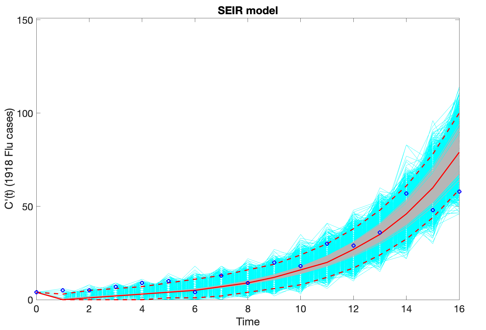
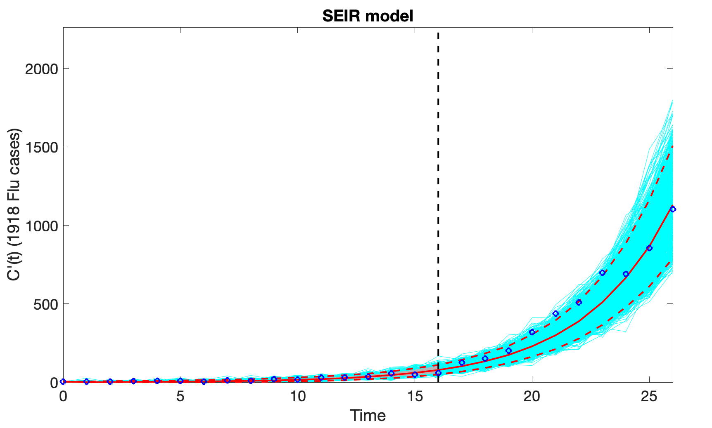
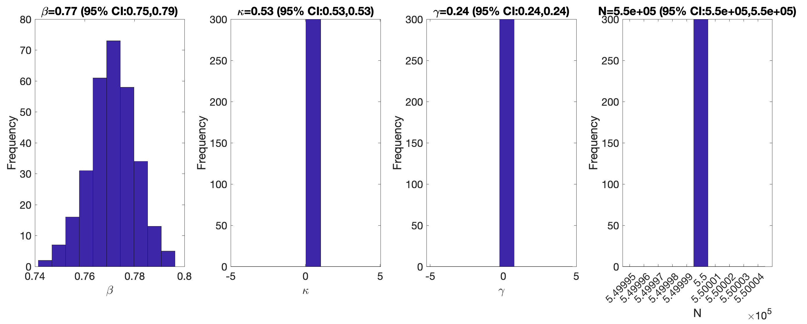
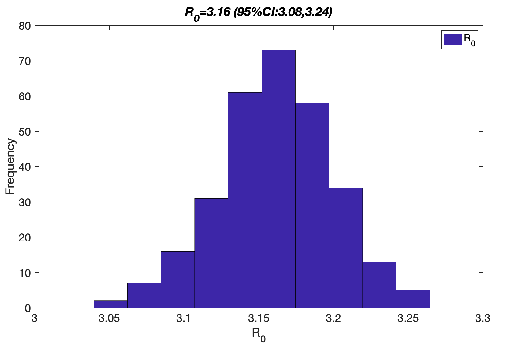
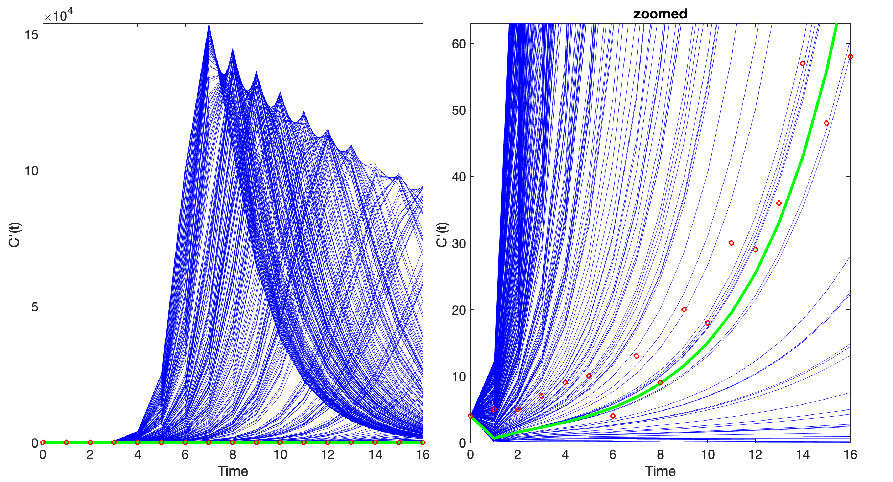
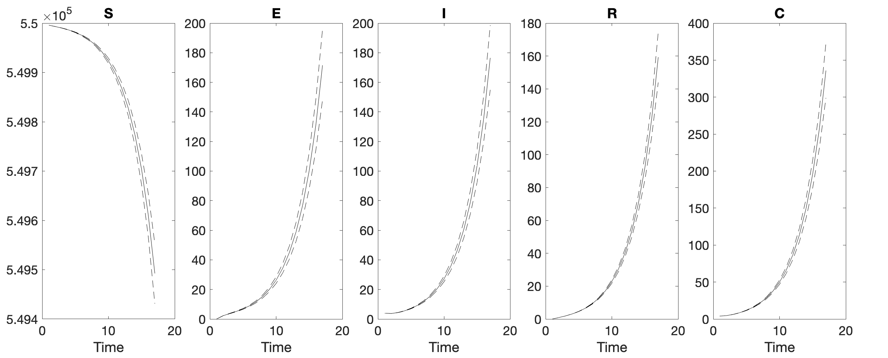
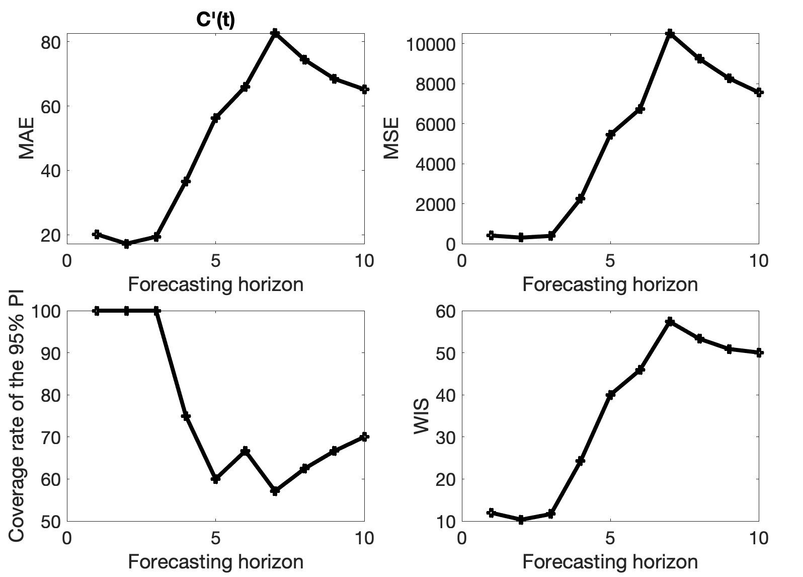

# QuantDiffForecast

### Parameter estimation, forecasting, and uncertainty quantification for ODE models in MATLAB

**QuantDiffForecast** connects ordinary differential equation (ODE) models with observed time-series data. It provides a workflow for estimating model parameters, quantifying uncertainty with parametric bootstrapping, and generating short-term forecasts. Users can fit one or multiple observed series, examine results across calibration windows, and adapt the workflow to their own dynamical models.

The repository includes an SEIR example using the 1918 influenza time series from San Francisco, together with fitting, forecasting, and visualization functions.

**[Published tutorial](https://doi.org/10.1002/sim.10036)** · **[Video tutorial](https://www.youtube.com/watch?v=eyyX63H12sY&t=41s)** · **[Quick start](#quick-start)** · **[Configuration](#configuration)** · **[Outputs](#outputs)** · **[Citation](#citation)**

## What the toolbox provides

- **Model calibration:** constrained parameter estimation using nonlinear least squares, Poisson or negative-binomial likelihoods, and multiple optimization starting points.
- **Uncertainty quantification:** bootstrap parameter distributions, percentile confidence intervals, and predictive simulations with observation noise.
- **Forecast evaluation:** calibration and held-out forecast summaries, including absolute and squared error, prediction-interval coverage, and weighted interval score (WIS).
- **Flexible workflows:** user-defined ODEs, selected fixed parameters, multiple observed series, derived quantities such as the basic reproduction number, and rolling calibration windows.

Start with the example below, then see [Using your own data](#using-your-own-data) and [Adding a model](#adding-a-model). Review the [implementation notes](#implementation-notes) before interpreting uncertainty or comparing model scores.

## Requirements and installation

### MATLAB source workflow

The fitting and bootstrap workflow uses the following MATLAB products:

| Product | Used for |
| --- | --- |
| MATLAB | ODE integration, data handling, tables, and graphics. |
| [Optimization Toolbox](https://www.mathworks.com/help/optim/ug/fmincon.html) | Constrained optimization with `fmincon`. |
| [Global Optimization Toolbox](https://www.mathworks.com/help/gads/multistart.html) | `MultiStart` and optimization start-point management. |
| [Statistics and Machine Learning Toolbox](https://www.mathworks.com/help/stats/index.html) | Random sampling for the observation models, including `poissrnd`, `nbinrnd`, and `normrnd`. |

Parallel Computing Toolbox is optional if you explicitly enable parallel `MultiStart` execution; the current fitting function does not enable it by default. No minimum MATLAB release for the source workflow is specified here.

Clone the repository in a terminal:

```bash
git clone https://github.com/gchowell/QuantDiffForecast-Toolbox.git
```

Alternatively, use **Code → Download ZIP** on GitHub and extract the archive.

In MATLAB, set **Current Folder** to the repository root—the folder containing this README—then run:

```matlab
codeDir = fullfile(pwd, 'forecasting_odemodels code');
assert(isfolder(codeDir), 'Set Current Folder to the repository root first.');
addpath(codeDir);
cd(codeDir);

% Inspect the installed products and locate key dependencies.
ver
which fmincon
which MultiStart
which nbinrnd
```

Run the examples from `forecasting_odemodels code`. The main fitting and forecasting functions create its `output` folder when needed. Keep only the intended version of the toolbox on your MATLAB path.

### Standalone applications

The separate [standalone folder](stand%20alone%20executable/) contains deployment files. Its [deployment instructions](stand%20alone%20executable/readme.txt) specify MATLAB Runtime **R2023b** for the Windows executable. Those instructions concern the compiled application, not a compatibility guarantee for the current MATLAB source. Do not assume a packaged executable contains every subsequent source-code update.

## Quick start

### Fit an SEIR model and forecast the next 10 observations

The data file [`curve-flu1918SF.txt`](forecasting_odemodels%20code/input/curve-flu1918SF.txt) is already included. This example uses the matching **negative-binomial likelihood family** in the following options files: `method1 = 3`, `dist1 = 3`.

| Task | Options file |
| --- | --- |
| Parameter estimation | [`options_fit_SEIR_flu1918_dist1_3.m`](forecasting_odemodels%20code/options_fit_SEIR_flu1918_dist1_3.m) |
| Forecasting | [`options_forecast_SEIR_flu1918_dist1_3.m`](forecasting_odemodels%20code/options_forecast_SEIR_flu1918_dist1_3.m) |

```matlab
fitOptions = @options_fit_SEIR_flu1918_dist1_3;
forecastOptions = @options_forecast_SEIR_flu1918_dist1_3;

% Fit rows 1:17, then inspect the fitted model and parameter summaries.
rng(1, 'twister');
Run_Fit_ODEModel(fitOptions, 1, 1, 17);
plotFit_ODEModel(fitOptions, 1, 1, 17);

% Calibrate and generate a 10-step-ahead forecast from the same data window.
rng(1, 'twister');
Run_Forecasting_ODEModel(forecastOptions, 1, 1, 17, 10);
plotForecast_ODEModel(forecastOptions, 1, 1, 17, 10);
```

The forecasting function **performs its own calibration and bootstrap**; it does not simply extend the preceding fit. Keep the options and numeric arguments unchanged when calling the corresponding plotting function, because they identify the saved results.

For this daily example, 10 steps correspond to 10 days. Other data frequencies require model rates expressed in the corresponding time unit. The two options files use the same likelihood family but have different starting values, bounds, and optimization budgets; inspect them before a controlled comparison.

To explore model trajectories before fitting, run this separately:

```matlab
plotODEModel(@options_fit_SEIR_flu1918_dist1_3);
```

Both quick-start options files request `B = 300` bootstrap datasets. For a preliminary installation check, reduce `B` in a **copy** of the options file, then increase it and check stability before reporting uncertainty estimates. A smaller bootstrap is a workflow check, not evidence of interval accuracy.

> **Check the settings, not just the filename.** The bundled `options_forecast_SEIR_flu1918_dist1_1.m` currently sets `method1 = 3` and `dist1 = 3`, despite its suffix. To select Poisson maximum likelihood, explicitly set `method1 = 1` in the relevant options file and verify the effective distribution.

## Example visualizations

These are existing repository illustrations, not reference outputs newly generated from the quick-start commands. Exact results depend on the configuration, random draws, and software version.

<table>
  <tr>
    <td width="50%" align="center">
      <br>
      <sub>Model fit</sub>
    </td>
    <td width="50%" align="center">
      <br>
      <sub>Forecast with uncertainty</sub>
    </td>
  </tr>
  <tr>
    <td width="50%" align="center">
      <br>
      <sub>Parameter estimates</sub>
    </td>
    <td width="50%" align="center">
      <br>
      <sub>Derived quantity: basic reproduction number</sub>
    </td>
  </tr>
</table>

<details>
<summary>Additional model-state and forecast-performance illustrations</summary>







</details>

## Using your own data

Place a numeric, header-free text file in [`forecasting_odemodels code/input`](forecasting_odemodels%20code/input/). Set `cadfilename1` in the options file to its name; the main runners append `.txt` when it is omitted.

```text
0   4
1   5
2   5
3   7
4   9
```

The first column is the **time index**. Every remaining column is an observed series to be fitted. Use consecutive, unit-spaced indices such as `0, 1, 2, ...`; the main runners use `DT = 1`. Keep a separate mapping to calendar dates when needed. Prepare missing or irregularly spaced observations upstream rather than passing `NaN`, `Inf`, or irregular intervals to the fitting workflow.

For Poisson and negative-binomial observation models, supply nonnegative integer counts. Continuous measurements require an appropriate observation model rather than being treated as counts.

### Match observations to model states

`vars.fit_index` identifies the state corresponding to each observed column, and `vars.fit_diff` specifies its transformation. For one series derived from state 5:

```matlab
vars.fit_index = 5;
vars.fit_diff = 1;
```

For two series corresponding to states 3 and 5, with the first fitted as a level and the second as an increment:

```matlab
vars.fit_index = [3, 5];
vars.fit_diff = [0, 1];
```

These vectors must have the same length as the number of observed columns, in the same order. Do not add unused covariate columns to the input file.

**Levels and increments are different observables.** With `fit_diff = 0`, the state itself is matched to the data. With `fit_diff = 1`, the current [observation mapping](forecasting_odemodels%20code/quantdiffObservationCurve.m) uses `abs([C(1); diff(C)])`: successive state increments, with the initial state prepended. It is not a continuous-time derivative and does not divide by a time increment. Check that a cumulative state is nondecreasing and that its initial-value convention matches your first observation.

The main fitting and forecasting runners **do not convert an input series simply because its filename begins with `cumulative-`**. Supply the intended observable explicitly and select the corresponding state transformation.

## Configuration

For a new analysis, copy one of the quick-start options files. Rename both the `.m` file and the function declared on its first function line, retaining its output list. Edit the copy rather than changing the shared example. Use a fitting-options function with `Run_Fit_ODEModel` and a forecasting-options function with `Run_Forecasting_ODEModel`; their output lists differ.

### Main settings

| Setting | Meaning |
| --- | --- |
| `cadfilename1` | Input filename under `input`. |
| `caddisease`, `datatype` | Labels used in figures and output filenames. |
| `method1` | Global variable set inside the options function; selects the fitting objective. |
| `dist1` | Observation-noise distribution used for bootstrap and predictive sampling. For supported positive `method1` values, the runners set `dist1 = method1`. |
| `numstartpoints` | Initial-fit exploration budget. The fitter also adds a seed and jittered starts; this is not the total number of local solves. |
| `B` | Number of synthetic bootstrap datasets to fit. |
| `model.fc`, `model.name` | ODE function handle and model label. |
| `params.label` | Parameter names, in the order expected by the ODE function. |
| `params.initial`, `params.LB`, `params.UB` | Starting values and finite lower/upper bounds; starting values must lie within bounds. |
| `params.fixed` | `1` fixes a parameter at its initial value; `0` estimates it. |
| `params.fixI0` | `1` fixes initial values of the selected fitted states to the first observations; `0` estimates those initial values. See the bootstrap caveat below. |
| `params.composite`, `params.composite_name` | Optional function and label for a derived quantity; use `[]` for no composite function. |
| `params.extra0` | Additional information passed to the ODE callback. |
| `vars.label`, `vars.initial` | State names and initial conditions. |
| `vars.fit_index`, `vars.fit_diff` | Observed-state indices and level/increment flags, in input-column order. |
| `windowsize1` | Number of observations in each calibration window. |
| `tstart1`, `tend1` | First and last **window-start row indices**, inclusive; these are not calendar dates. |
| `forecastingperiod` | Number of forecast steps beyond the calibration window. |
| `getperformance` | Controls forecast-performance output in the forecasting workflow; it is not a global switch disabling all score calculations. |
| `printscreen1` | Controls selected displays; setting it to `0` does not guarantee a completely silent or figure-free run. |

The main runners infer `params.num` and `vars.num` from their label vectors. Keep parameter and state vectors internally consistent. Explicit window and horizon arguments in the function call override their defaults in the options file.

### Estimation methods and observation models

Let `mu` denote the model-predicted observation, `alpha` the fitted negative-binomial dispersion parameter, and `d` its variance exponent.

| `method1` | `dist1` | Fitting objective | Bootstrap observation model |
| --- | --- | --- | --- |
| `0` | `0` | Sum of squared residuals | Normal |
| `0` | `1` | Sum of squared residuals | Poisson |
| `0` | `2` | Sum of squared residuals | Negative binomial, variance `factor1 * mu`, with an empirically estimated factor |
| `1` | `1` | Poisson negative log-likelihood | Poisson, variance `mu` |
| `3` | `3` | Negative-binomial negative log-likelihood | Variance `mu + alpha * mu` |
| `4` | `4` | Negative-binomial negative log-likelihood | Variance `mu + alpha * mu^2` |
| `5` | `5` | Negative-binomial negative log-likelihood | Variance `mu + alpha * mu^d` |
| `6` | `6` | Sum of absolute deviations | Laplace; see the information-criterion caveat below |

**Changing `dist1` with `method1 = 0` does not change the objective into weighted least squares or maximum likelihood.** It changes the observation-noise model used after least-squares fitting. Also, `dist1 = 2` is not an instruction to use `method1 = 2`; that objective is not supported by the current helper.

See [the objective implementation](forecasting_odemodels%20code/quantdiffObjectiveValue.m) and [observation-noise generator](forecasting_odemodels%20code/AddErrorStructure.m) for the implemented conventions.

## Rolling windows and forecast horizons

For a window starting at row `i`, the calibration rows are `i : i + windowsize1 - 1`. The forecast origin is the **last calibration observation**. With the quick-start arguments, rows 1–17 are fitted and rows 18–27 are the held-out targets when available.

The native rolling interface accepts different start and end indices. However, **some current CSV filenames are reused within a multi-window call**, so later windows can overwrite earlier CSV exports. Per-window MAT snapshots are saved separately. For distinct CSV results at three origins, run and plot each window separately:

```matlab
forecastOptions = @options_forecast_SEIR_flu1918_dist1_3;

for firstRow = 1:3
    rng(1000 + firstRow, 'twister');
    Run_Forecasting_ODEModel(forecastOptions, firstRow, firstRow, 17, 10);
    plotForecast_ODEModel(forecastOptions, firstRow, firstRow, 17, 10);
end
```

Forecast-performance rows labeled horizon `h` summarize steps **1 through h**, not only the observation at lead `h`. Evaluating the full forecast requires observed targets through `i + windowsize1 + forecastingperiod - 1`; the current scoring helpers skip forecast evaluation when the requested full horizon is unavailable.

For a forecast beyond the available data, future observations are naturally unknown. The current CSV export can also leave their **time** entries as `NaN`; use the saved `timevect2` grid to identify those future targets.

## Outputs

Results are written under `forecasting_odemodels code/output`. Filenames encode combinations of the model, estimation method, error distribution, initial-condition setting, calibration window, fitted state, and horizon. Not every export encodes every setting, so preserve outputs before changing a run's configuration.

| File or prefix | Contents and interpretation |
| --- | --- |
| `parameters-rollingwindow-*.csv` | Bootstrap parameter medians and 2.5th/97.5th percentiles. Some column labels say “mean,” although the calculation uses a median. |
| `parameters-composite-*.csv` | Corresponding summaries for a derived quantity, when configured. Its central summary is also a median despite the “mean” label. |
| `MCSEs-rollingwindow-*.csv` | `std(bootstrap draws)/sqrt(B)` summaries; these are not parameter confidence intervals or Monte Carlo errors of the median. |
| `SCIs-rollingwindow-*.csv` | Legacy log interval-ratio diagnostics; see the implementation notes before interpretation. |
| `AICc-*.csv` | Columns `time`, `AICc`, `AICc part1`, `AICc part2`, and `numparams`; no separate AIC or BIC columns are produced here. |
| `Forecast-model_name-*.csv` | Columns `time`, `data`, `median`, `LB`, and `UB`; the bounds are 2.5th/97.5th predictive percentiles. May include both calibration and forecast periods. |
| `performance-calibration-*.csv` | Columns `time`, `calibration_period`, `MAE`, `MSE`, `Coverage 95%PI`, and `WIS`. |
| `performance-forecasting-*.csv` | Columns `forecasting_horizon`, `MAE`, `MSE`, `Coverage 95%PI`, and `WIS`. Coverage is expressed as a percentage. |
| `quantile-*.csv` | Quantile tables exported by the plotting functions, using 23 probability levels from 0.01 to 0.99. |
| `StateVars-*.csv` | State-trajectory medians and 2.5th/97.5th percentiles across bootstrap fits. |
| `*-histogram-rollingwindow-*.csv` | Parameter histogram bins and counts, when generated. |
| `bootstraps-ODEModel-*.mat` | Bootstrap parameter draws, objective values, and `numericalAudit`. |
| `parameters-ODEModel-*.mat` | Parameter summary array and `numericalAudit`. |
| `Forecast-ODEModel-*.mat` | Saved per-window/per-series workspace, including forecast arrays, grids, and run variables used by the plotting functions. |

In the main runners, `forecast_model1` contains trajectories propagated from bootstrap parameter fits; `forecast_model12` additionally includes sampled observation noise. Parameter confidence intervals and observation prediction intervals therefore answer different questions. These are **frequentist bootstrap draws, not posterior samples**. The MAT files should not be assumed to include the random-number-generator state automatically.

The default performance CSVs report **MSE**, not RMSE or MAPE. Other metrics calculated internally are not necessarily exported in those tables.

## Adding a model

Use [`SEIR1.m`](forecasting_odemodels%20code/SEIR1.m) as a compartmental-model example. The main solver calls an ODE function with **four inputs**: time, state vector, parameter vector, and `params.extra0`. Return a column vector with one derivative per state.

For example, save this complete one-state model as `myExponentialModel.m` in the code directory:

```matlab
function dx = myExponentialModel(~, x, theta, ~)
    % One-state exponential growth; theta(1) is the growth rate.
    dx = theta(1) .* x(:);
end
```

In a copied options file, replace the model, parameter, and state settings with:

```matlab
model.fc = @myExponentialModel;
model.name = 'Exponential growth';

params.label = {'r'};
params.initial = 0.1;
params.LB = 0;
params.UB = 1;
params.fixed = 0;
params.fixI0 = 1;
params.composite = [];
params.composite_name = '';
params.extra0 = [];

vars.label = {'C'};
vars.initial = 4;
vars.fit_index = 1;
vars.fit_diff = 1;
```

This example treats `C` as an accumulating state and fits its increments. Retain the copied options function's output list, data settings, estimation method, bootstrap settings, and window/horizon settings. Adapt bounds and initial conditions to the application rather than treating these illustrative values as defaults for every dataset.

Composite functions receive a matrix of parameter draws, with one draw per row. See [`R0s.m`](forecasting_odemodels%20code/R0s.m) for an example. Verify callback signatures and dependencies before using other bundled or contributed models.


## Troubleshooting and support

| Symptom | What to check |
| --- | --- |
| MATLAB cannot find a runner or options function | Check Current Folder, `addpath`, and `which Run_Forecasting_ODEModel -all`. Remove conflicting toolbox copies from the path. |
| `fmincon`, `MultiStart`, or a random-sampling function is unavailable | Verify the required MATLAB products are installed and licensed. |
| A plotting function cannot find its MAT file | Run the matching fitting/forecasting function first and use the same options, method, window indices, and horizon. |
| A custom ODE produces “Too many input arguments” | Its callback must accept all four inputs, even when the last input is unused. |
| Data dimensions or values are rejected | Check the numeric input format, finite values, unit-spaced time grid, and one observation mapping per data column. |
| An options filename and function declaration differ | When copying an options file, update the declared function name to match the new filename. |

For reproducible bug reports, open a [GitHub issue](https://github.com/gchowell/QuantDiffForecast-Toolbox/issues) with the exact command, options file, MATLAB/toolbox versions, source revision, error message, and a minimal shareable dataset. Include relevant diagnostics, but do not upload confidential data.

For scientific questions, contact **Gerardo Chowell**, Georgia State University, at [gchowell@gsu.edu](mailto:gchowell@gsu.edu).

## Citation

Please cite the toolbox tutorial when using QuantDiffForecast in research:

Chowell G, Bleichrodt A, Luo R. **Parameter estimation and forecasting with quantified uncertainty for ordinary differential equation models using QuantDiffForecast: A MATLAB toolbox and tutorial.** *Statistics in Medicine*. 2024;43(9):1826–1848. [doi:10.1002/sim.10036](https://doi.org/10.1002/sim.10036).

```bibtex
@article{Chowell2024QuantDiffForecast,
  author  = {Gerardo Chowell and Amanda Bleichrodt and Ruiyan Luo},
  title   = {Parameter estimation and forecasting with quantified uncertainty
             for ordinary differential equation models using {QuantDiffForecast}:
             A {MATLAB} toolbox and tutorial},
  journal = {Statistics in Medicine},
  year    = {2024},
  volume  = {43},
  number  = {9},
  pages   = {1826--1848},
  doi     = {10.1002/sim.10036}
}
```

Report the source revision and analysis configuration alongside the citation so that readers can identify the implementation used.

## License

See the repository's [LICENSE](LICENSE) file for the distributed licensing terms.
